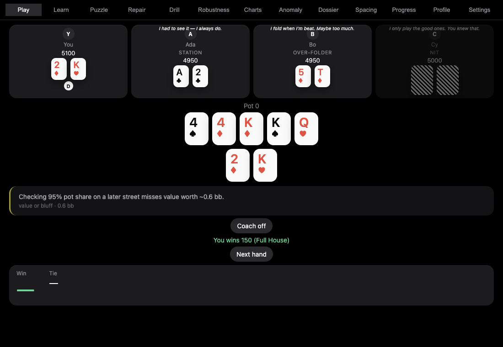
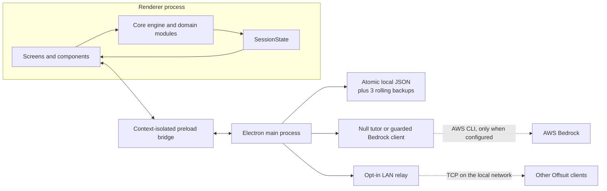
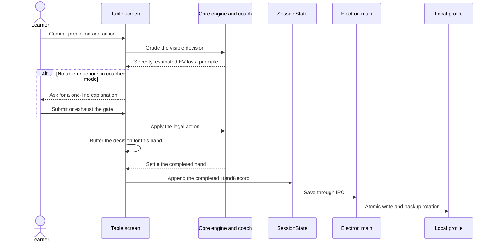

# Offsuit

Offsuit is an Electron Texas Hold'em trainer built around a playable four-handed
table. It records the situation behind each decision, estimates its cost, and
connects that evidence to lessons, drills, assessment blocks, and hand review.

Gameplay, grading, lessons, and written coaching work locally without model
credentials. Network access is limited to two explicit features: an optional AWS
Bedrock tutor and multiplayer intended for trusted local networks.



## What is implemented

| Area | Current behavior |
| --- | --- |
| Solo play | Complete no-limit Hold'em hands against three seeded, rule-based opponents selected from six behavioral archetypes |
| Decision coaching | Optional prediction and confidence commitment, estimated EV-loss verdicts, and a short self-explanation gate for notable mistakes |
| Curriculum | 24 authored lessons across rules, perception, arithmetic, and strategy principles; no lesson is locked |
| Practice | Scenario spots, poker math, hand reading, board reading, anomaly recognition, stress tests, leak repair, and spaced upkeep |
| Review and progress | Persisted bankroll and hand records, per-decision replay, VPIP/PFR and leak summaries, calibration, concept evidence, and assessment results |
| Assessment | A 30-hand block using the same table engine and grader as solo play, with feedback withheld until the end |
| Multiplayer | Explicitly enabled, host-authoritative tables for 2-6 players on a trusted network, with per-player card redaction |
| Tutor | Fixed local answers by default; optional AWS Bedrock responses pass through phase gates and mechanical output guards |

The poker engine handles legal actions, betting rounds, all-ins, uncalled chips,
side pots, showdown evaluation, and settlement. Seeded randomness makes deals and
opponent behavior reproducible for tests and debugging.

## Product workflow

1. **Choose a direction.** Home shows the current bankroll, earned table depth,
   recent hands, one evidence-based recommendation, and a session planner.
2. **Play a hand.** The same core engine drives the table, opponents, legal
   actions, and settlement.
3. **Commit before feedback.** In coached mode, Offsuit asks for an outcome
   prediction and confidence before exposing decision feedback. A notable error
   can require a one-line explanation before the verdict appears.
4. **Keep the evidence.** The completed hand stores the board, pot, price,
   action, sizing, verdict, and explanation attempts for each recorded decision.
5. **Review or train.** Replay the hand, inspect aggregate leaks, work a focused
   drill, or take an assessment where feedback is delayed until the block ends.

Network multiplayer is a separate, opt-in path from Home. The host owns the room
state, validates turn ownership and action legality, and sends each participant a
redacted `RoomView`. It listens on all IPv4 interfaces so peers on the local
network can connect; firewall and routing configuration determine its actual
reachability.

## Architecture

The domain code is intentionally independent of Electron. `src/core` contains
the poker and teaching logic; the renderer composes those modules into screens;
the main process owns privileged I/O.



### Coached-hand data flow



### Important boundaries

| Path | Responsibility |
| --- | --- |
| [`src/core/table.ts`](src/core/table.ts) | Table state machine, action validation, street progression, and settlement |
| [`src/core/evaluate.ts`](src/core/evaluate.ts), [`src/core/equity.ts`](src/core/equity.ts) | Hand evaluation, exact heads-up equity, and seeded Monte Carlo equity |
| [`src/core/coach.ts`](src/core/coach.ts) | Decision grading and estimated EV-loss messages |
| [`src/core/session.ts`](src/core/session.ts) | Persisted profile schema, migration defaults, bounded logs, and aggregate counters |
| [`src/core/lessons/`](src/core/lessons/) | Typed, validated lesson registry and authored lesson content |
| [`src/core/multiplayer.ts`](src/core/multiplayer.ts) | Pure room reducer, turn checks, and recipient-specific state redaction |
| [`src/renderer/main.ts`](src/renderer/main.ts) | UI composition, navigation, and session orchestration |
| [`src/main/preload.ts`](src/main/preload.ts) | Narrow IPC surface exposed through `contextBridge` |
| [`src/main/main.ts`](src/main/main.ts) | Window lifecycle, IPC handlers, network policy, speech, tutor, and relay lifecycle |
| [`src/main/store.ts`](src/main/store.ts), [`src/core/backup.ts`](src/core/backup.ts) | Atomic profile writes, three-version recovery, settings, and confirmed deletion |
| [`src/main/tutor/`](src/main/tutor/) | Request shaping, phase/mute rules, fixed fallback, Bedrock bridge, and output guards |

The renderer runs with context isolation and without Node integration. Electron
sessions allow local schemes only. The two deliberate network paths are outside
that session layer: the optional tutor invokes Bedrock through an authenticated
AWS CLI process, and multiplayer uses Node TCP sockets after the user enables it.

## Technology

| Technology | Role and rationale |
| --- | --- |
| Electron 33 | Desktop shell and separation between unprivileged UI and privileged local I/O |
| TypeScript 5.9 | Strict types across engine state, persisted data, IPC contracts, and UI code |
| Vite 6 | Renderer development and production bundling |
| Vanilla DOM and CSS | Direct control over keyboard behavior, screen lifecycle, and compact table layouts without a UI framework |
| Vitest | Fast tests for pure engine, teaching, persistence, tutor, and relay logic |
| Playwright | End-to-end tests against the built Electron application |
| Node built-ins | Filesystem persistence, local speech integration, child processes, and TCP relay transport |

There are no declared runtime packages. The application and its build/test tools
are installed from `devDependencies` and bundled or launched by the repository
scripts.

## Repository layout

```text
src/core/       Poker engine, coaching, curriculum, progress, and pure relay logic
src/main/       Electron entry point, preload, storage, tutor, speech, and networking
src/renderer/   Application composition, screens, components, sound, and styles
tests/unit/     Vitest coverage for domain and main-process modules
tests/e2e/      Serialized Playwright coverage against Electron
scripts/        Audit probes, experiments, and affected-test tooling
demo/           Static design explorations; not part of the runtime application
research/       Product and pedagogy research; not proof of implemented behavior
screenshots/    Visual regression and audit artifacts
```

`PRODUCT-SPEC.md`, `SPEC.md`, and the superseded product spec contain design
history. This README treats source and executable tests as the implementation
record.

## Setup

The repository does not pin a Node version. Use a current Node.js LTS release
with npm.

```bash
npm ci
npm start
```

`npm start` builds the main process, preload, and renderer, then launches
Electron. Profile data is stored under Electron's per-user application data
directory as `offsuit-state.json`; the Settings screen shows the resolved path
and backup status.

For a quick renderer-only preview:

```bash
npm run dev
```

Vite prints a local URL to open in a browser and keeps state in memory. This mode
does not provide Electron persistence, local speech, the tutor bridge, or
network multiplayer.

### Optional Bedrock tutor

The local fixed-answer tutor is used unless all three variables are present:

```bash
OFFSUIT_BEDROCK_PROFILE=<aws-profile> \
OFFSUIT_BEDROCK_REGION=<region> \
OFFSUIT_BEDROCK_MODEL=<model-id> \
npm start
```

This development integration requires an authenticated AWS CLI profile and a
Bedrock model compatible with the request format in
[`src/main/tutor/bedrock.ts`](src/main/tutor/bedrock.ts). Model output is retried
once on failure or guard rejection, then falls back to the checked-in answer
table. Settings exposes whether the tutor is live, its resolved host allowlist,
and recent guard failures.

## Development and verification

| Command | Purpose |
| --- | --- |
| `npm run typecheck` | Strict TypeScript check without emitting files |
| `npm test` | Run the Vitest unit suite once |
| `npm run test:watch` | Run Vitest in watch mode |
| `npm run build` | Compile main/preload and bundle the renderer |
| `npm run e2e` | Build, then run Playwright's serialized Electron suite |
| `npx vitest run tests/unit/perf.test.ts` | Run the documented engine performance gates |

The checked-in suite includes 76 unit test files and 58 Electron E2E specs. It
covers betting legality, chip conservation, all-ins and side pots, deterministic
deals, corrupt-profile recovery, tutor payload and output guards, multiplayer
redaction, keyboard and screen-reader behavior, minimum-window layouts, soak
flows, and performance budgets.

E2E launches use fixed seeds and isolated user-data directories. Network
coverage includes a loopback proxy with a positive control, so the no-network
test demonstrates that its external oracle can observe an escaped request.
Playwright retains traces and screenshots on failure. Performance baselines and
the self-scaling regression gates are documented in
[`BENCHMARKS.md`](BENCHMARKS.md).

There is no checked-in CI workflow; these commands are currently local
verification entry points.

## Current scope and limitations

- The coach is not a poker solver. It uses seeded 2,000-iteration equity
  estimates against random hands plus documented decision heuristics. Its EV-loss
  output is teaching feedback, not a GTO solution.
- The session planner displays a proposed mix of work, but starting it currently
  opens the ordinary solo table rather than orchestrating each displayed block.
- Progress intentionally withholds win-rate and results-graph output because
  normal hand records do not store all-in-adjusted EV. Fluency remains empty
  because reaction times are not yet wired into that progress input.
- Multiplayer is intended for trusted local networks, but the host binds all
  IPv4 interfaces; firewall and routing configuration determine exposure. It has
  no matchmaking, authentication, encryption, coaching, or multiplayer
  hand-history persistence.
- The Bedrock path is a developer integration through the AWS CLI, not a packaged
  credential or account flow.
- Spoken verdicts use macOS `/usr/bin/say` by default. The visual verdict remains
  available when speech is unsupported or disabled.
- The repository has build and launch scripts, but no installer, signing, or
  release packaging workflow.
